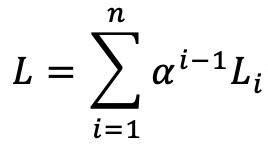

# Recursive-CycleGAN

## Introduction
Recursive CycleGAN is a variant of CycleGAN, which was first proposed in [this paper](https://arxiv.org/pdf/1703.10593.pdf).
In CycleGAN, the object is to learn to mappings G: X -> Y, F: Y -> X, as well as two discriminators D_X, D_Y. An input image from domain X is passed into generator G to land in domain Y, then passed in generator F to land back to X. Another input image from domain Y is processed in the reversed direction. Adversarial losses, cycle consistency loss and an optional identity loss are calculated.

In Recursive CycleGAN, we keep the same setting but make an input image go through the described cycle for multiple rounds instead of just one. 

During each cycle, we calculated adversarial losses, cycle consistency loss and identity loss the same way as in CycleGAN. Then we add them together (weighted sum) as the final loss. If L_i denotes the cycle consistency loss, for example, at the ith cycle. Then the total cycle consistency loss is calculated as the following:

